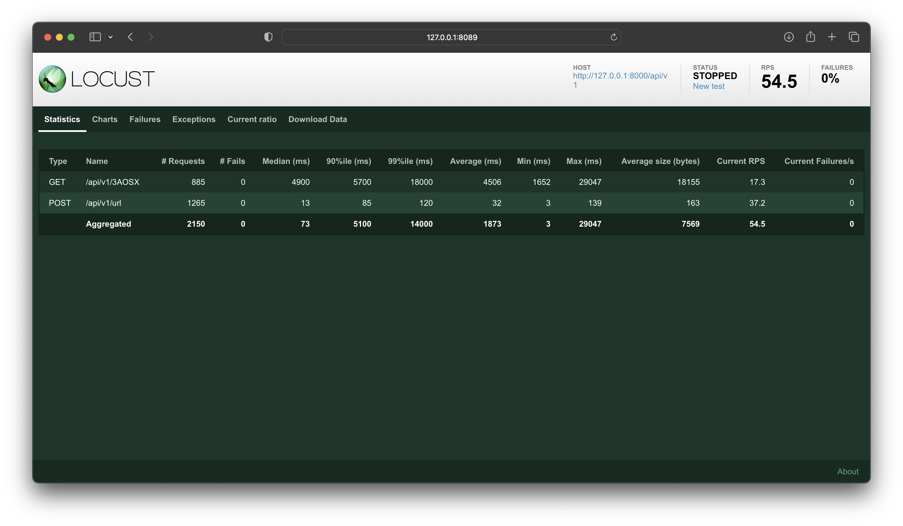

# Async FastAPI URL Shortener

## Run the Project with Docker-Compose

1. Create a .env file from [`.env.sample`](./src/.env.sample) and update environment variables.

```sh
$ cp .env.sample .env
```

2. Build the images and run the containers.

```
$ docker-compose -f docker-compose.yml up -d --build
```

## Verify Your Environment Variables

The project provides default environment settings in [`config.py`](./src/app/api/config.py).
While you can use the default settings, [it's recommended](https://12factor.net/config) to create a `.env` file to store your settings outside of your production code. E.g.:

```config
# .env

// FastAPI environment variables
ENV_NAME=Local
BASE_URL=http://localhost:80
DB_HOST=localhost
DB_NAME=url-shortner
DB_USER=database_username
DB_PASSWORD=database_password

// Docker Postgresql environment variables
POSTGRES_USER=database_username
POSTGRES_PASSWORD=database_password
POSTGRES_DB=url-shortner
```

To get an overview of the environment variables you can set, check the [`config.py`](./src/app/api/config.py) file.

> ☝️ **Note:** You should never add the `.env` file to your version control system. 

## Run Pytests
Tests are in [`tests`](./src/tests) folder.
Run test with:
```
$ cd ./src/
$ pytest
```

## Run the Pressure test
Run this test with locust command in /src/tests/pressure-test folder, for checking the presure test config, see [`locustfile.py`](./src/tests/pressure-test/locustfile.py) file.
```
$ cd ./src/tests/pressure-test/
$ locust
```
Pressure test results with 1000 Number of users and 20 Spawn Rate:


> ☝️ **Note:** The higher average response time becouse the main link of this shorten url is https://google.com and it takes a time for redirecting.

## Visit the Documentation

When the project is running you can visit the documentation in your browser:

- http://127.0.0.1:80/docs

## About the Author

Mohammad Amin Parvanian - Email: amin_prvn@outlook.com
